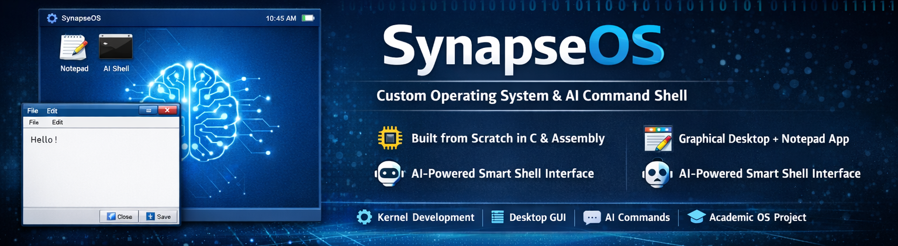

<p align="center">
  
</p>
# 🧠 SynapseOS

**SynapseOS** is a custom-built operating system developed from scratch using **low-level system programming (C, Assembly, and a custom kernel)**.
It features a simple graphical desktop environment, built-in applications, and an experimental **AI-driven command system**.

This project demonstrates **core operating system concepts**, including kernel development, bootloading, graphics initialization, input handling, and application management.

---

# 📘 User Manual

**Version:** 1.0
**Developed by:** Group-7

---

# 🚀 Introduction

SynapseOS is designed as an **educational operating system project** that showcases how modern operating systems work internally.

It includes:

* Custom bootloader
* Custom kernel
* Graphical desktop interface
* Built-in applications
* Smart Shell with natural-language commands
* Planned AI integration

The system runs in **virtual environments such as VirtualBox or QEMU**.

---

# 💻 System Requirements

SynapseOS is lightweight and can run on minimal hardware.

## Minimum Requirements

| Component      | Requirement       |
| -------------- | ----------------- |
| CPU            | x86 (32-bit)      |
| RAM            | 64 MB             |
| Storage        | 100 MB            |
| Virtualization | VirtualBox / QEMU |

## Recommended Setup

* Processor: Dual-Core
* RAM: 256 MB or more
* Display: 1024 × 768 resolution

---

# ⚙️ Installation Guide

## 1. Install Using VirtualBox

1. Open **VirtualBox**
2. Click **New Virtual Machine**
3. Configure the VM:

```
Type: Other
Version: Other / Unknown (32-bit)
```

4. Allocate **256 MB RAM**
5. Attach the **SynapseOS ISO**
6. Start the virtual machine

---

# 🖥️ Boot Process

When the system boots:

1. Bootloader loads
2. Kernel initializes
3. Graphics mode activates
4. Desktop GUI appears

---

# 🖼️ Desktop Environment

SynapseOS provides a simple graphical desktop environment.

## Components

* **Top Taskbar** – displays system title *SynapseOS*
* **Clock** – shows current time
* **Application Icons** – launch built-in apps
* **Wallpaper** – customizable background
* **Mouse Support** – GUI interaction

---

# 📦 Built-in Applications

## 📝 Notepad Application

A lightweight text editor included in SynapseOS.

### Features

* Write and edit text
* Keyboard input support
* Caret movement
* Basic text editing
* Internal memory save (temporary)

### Keyboard Shortcuts

| Shortcut   | Action           |
| ---------- | ---------------- |
| Ctrl + S   | Save text        |
| Esc        | Close Notepad    |
| Arrow Keys | Move caret       |
| Enter      | New line         |
| Backspace  | Delete character |

---

# 🤖 Smart Shell (AI Command System)

SynapseOS includes an experimental **Smart Shell** capable of interpreting **natural-language commands**.

## Example Commands

| Command       | Action               |
| ------------- | -------------------- |
| open notepad  | Launch Notepad       |
| close notepad | Close Notepad        |
| show time     | Display system clock |
| clear screen  | Clear shell display  |
| help          | Show command list    |

---

# 🧠 Planned AI Integration

Future versions of SynapseOS aim to include a built-in **AI Assistant**.

## Planned Features

* Voice recognition (offline speech-to-text)
* Natural language understanding
* OS automation
* AI-powered chatbot
* Application control via voice

---

# 🎤 AI Assistant (Future Usage)

Example commands:

| Voice Command               | Action                        |
| --------------------------- | ----------------------------- |
| "Write an email in Notepad" | Opens Notepad and types email |
| "Explain quantum computing" | AI chatbot answers            |
| "Close all windows"         | OS closes applications        |

---

# 📁 File System

Current implementation is **memory-based**.

### Current Capabilities

* In-memory storage for Notepad text
* Temporary document handling

### Planned Improvements

* FAT filesystem support
* EXT filesystem support
* Persistent storage

---

# 🛠️ Troubleshooting

### Notepad not closing

Press:

```
ESC
```

---

### Screen frozen

Restart the virtual machine.

---

### Smart Shell not responding

Try:

* Re-opening the shell
* Ensuring keyboard focus

---

### Build errors

Ensure the following are installed:

* GCC cross-compiler
* Required build tools
* Proper kernel configuration

Check **kernel logs** for debugging.

---

# 📌 Project Goals

SynapseOS was built to demonstrate:

* Operating system fundamentals
* Kernel development
* Bootloader programming
* GUI systems in OS
* System-level programming in **C and Assembly**

---

# 📈 Future Improvements

* Full filesystem implementation
* Advanced window manager
* Networking support
* Package manager
* AI-powered system assistant
* Voice-controlled OS commands

---

# ⭐ Contribution

Contributions, ideas, and improvements are welcome.

Feel free to **fork the project and submit pull requests**.

---

# 📜 License

This project is intended for **educational purposes**.

---

# 👨‍💻 Authors

Shubham Vishwakarma

LinkedIn:
https://linkedin.com/in/shubham-vishwakarma-358332209

